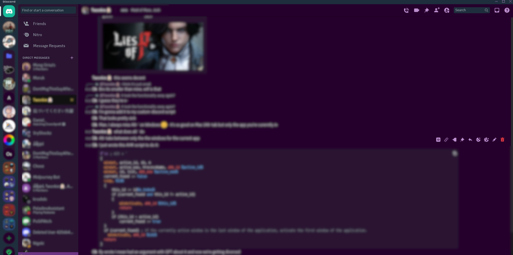

# Custom Discord

## Introduction

This project aims to provide some lightweight modifications for Discord.

Currently, the planned features are:

- [X] Custom CSS
- [X] Custom JavaScript
- [ ] Support for different link protocols (e.g. `steam:`)
- [ ] A better theme changer
- [ ] A simple button to get an Auth token for use with external apps (such as [DiscordChatExporter](https://github.com/Tyrrrz/DiscordChatExporter)

If you want a more feature-complete solution, a better alternative might be [BetterDiscord](https://betterdiscord.app/).

I've only tested this in my local Windows environment (Windows 11), using leveraging PowerShell. No promises that this will work in other environments (or even that it will work in the same environment on your machine).

The default theme is a dark purple colored theme. If you want to change it, you can modify the `custom_discord.js` file under `$ENV:USERPROFILE/AppData/Local/Discord/custom_discord/`

Screenshot of the theme: 

## Overview

The script primarily instals NPM/NodeJS, and then uses the `asar` package to extract, modify and re-pack the `core.asar` file used by Discord.

This is a hacky solution, but it does the job well enough for me. If you have a burning desire to see it improved, feel free to submit a PR 😊.

### Themes

The themes are basically generated off of popular themes. Generated how? Via ChatGPT - so be warned, some of them are shit. Why do I include them? Well, I'm lazy.

### Pre-Requisites

To run the installer script, you will need Powershell available on your machine (Which should be the case for most Windows machines).

### Installation

This script:

1. Installs NodeJS and NPM.
2. Navigates to the Discord AppData directory.
3. Extracts `core.asar` to work with the raw files.
4. Backs up original resources for safety.
5. Unzips and applies the custom modifications.
6. Re-packs `core.asar`.

If you're not sure how to run a PowerShell script, then you probably shouldn't run the following. But, if you insist, then you can follow these steps:

- Download or clone this repository somewhere (The installer script assumes you've downloaded and extracted the contents of this repository to '~/Downloads/custom_discord')
- Download `install.ps1`
- Press `Windows + R` to open the Run dialog
- Type `powershell` to open PowerShell
- Navigate to the directory where you downloaded `install.ps1`
- Run the PowerShell script by typing `.\install.ps1`

Run the PowerShell script by searching for PowerShell, clicking it, and 

### Themes

|                        Filename                         |               Human-readable Formatted Name               |
| ------------------------------------------------------- | --------------------------------------------------------- |
| atom_one_dark_alt.css                                   | Atom One Dark Alt                                         |
| atom_one_dark.css                                       | Atom One Dark                                             |
| dracula_alt_2.css                                       | Dracula Alt 2                                             |
| dracula_alt.css                                         | Dracula Alt                                               |
| dracula.css                                             | Dracula                                                   |
| ex_p2_DarkVibrant.css                                   | Ex P2 Dark Vibrant                                        |
| ex_p2_Eclipse.css                                       | Ex P2 Eclipse                                             |
| ex_p2_GothicNightfall.css                               | Ex P2 Gothic Nightfall                                    |
| ex_p2_vibrant_eclipse.css                               | Ex P2 Vibrant Eclipse                                     |
| ex_p2_vibrant_eclipses.css                              | Ex P2 Vibrant Eclipses                                    |
| ex_p2_VibrantNightfall.css                              | Ex P2 Vibrant Nightfall                                   |
| exp_plus_one_dark_pro_tomorrow_night_dark_chalk.css     | Exp Plus One Dark Pro Tomorrow Night Dark Chalk           |
| exp_plus_one_dark_pro.css                               | Exp Plus One Dark Pro                                     |
| experimental_AtomOneDark.css                            | Experimental Atom One Dark                                |
| experimental_Dracula.css                                | Experimental Dracula                                      |
| experimental_gruvbox_dark.css                           | Experimental Gruvbox Dark                                 |
| experimental_OneDarkPro.css                             | Experimental One Dark Pro                                 |
| experimental_TomorrowNight.css                          | Experimental Tomorrow Night                               |
| experimental_TomorrowNightBright.css                    | Experimental Tomorrow Night Bright                        |
| experimental_TomorrowNightEighties.css                  | Experimental Tomorrow Night Eighties                      |
| experimental_v2_Dracula.css                             | Experimental V2 Dracula                                   |
| experimental_v2_OneDark.css                             | Experimental V2 One Dark                                  |
| experimental_v2_OneDarkDark.css                         | Experimental V2 One Dark Dark                             |
| experimental_v2_OneDarkDarker.css                       | Experimental V2 One Dark Darker                           |
| experimental_v2_OneDarkDeep.css                         | Experimental V2 One Dark Deep                             |
| experimental_v2_OneDarkPro.css                          | Experimental V2 One Dark Pro                              |
| experimental_v2_TomorrowNight.css                       | Experimental V2 Tomorrow Night                            |
| experimental_v2_TomorrowNightBright.css                 | Experimental V2 Tomorrow Night Bright                     |
| experimental_v2_TomorrowNightEighties.css               | Experimental V2 Tomorrow Night Eighties                   |
| experimental_vibrant_nightfall.css                      | Experimental Vibrant Nightfall                            |
| extra_experimental_OneDarkPro.css                       | Extra Experimental One Dark Pro                           |
| extra_experimental_OneDarkProTomorrowNightDarkChalk.css | Extra Experimental One Dark Pro Tomorrow Night Dark Chalk |
| material_one_dark_purple.css                            | Material One Dark Purple                                  |
| new_style_AtomOneDark.theme.css                         | New Style Atom One Dark                                   |
| new_style_Dracula.theme.css                             | New Style Dracula                                         |
| new_style_OneDarkPro.theme.css                          | New Style One Dark Pro                                    |
| new_style_SolarizedDark.theme.css                       | New Style Solarized Dark                                  |
| new_style_TomorrowNight.theme.css                       | New Style Tomorrow Night                                  |
| new_style_TomorrowNightBright.theme.css                 | New Style Tomorrow Night Bright                           |
| new_style_TomorrowNightEighties.theme.css               | New Style Tomorrow Night Eighties                         |
| new_style_Zenburn.theme.css                             | New Style Zenburn                                         |
| one_dark_pro.css                                        | One Dark Pro                                              |
| purple_own.css                                          | Purple Own                                                |
| solarized_dark.css                                      | Solarized Dark                                            |
| tomorrow_night_alt_2.css                                | Tomorrow Night Alt 2                                      |
| tomorrow_night_alt_3.css                                | Tomorrow Night Alt 3                                      |
| tomorrow_night_alt.css                                  | Tomorrow Night Alt                                        |
| tomorrow_night_bright_alt.css                           | Tomorrow Night Bright Alt                                 |
| tomorrow_night_bright.css                               | Tomorrow Night Bright                                     |
| tomorrow_night_eighties_alt.css                         | Tomorrow Night Eighties Alt                               |
| tomorrow_night_eighties.css                             | Tomorrow Night Eighties                                   |
| tomorrow_night.css                                      | Tomorrow Night                                            |
| zenburn.css                                             | Zenburn                                                   |


### Additional Details

In case this repository becomes outdated, and you want to know what the code looks like that this script was modifying (or if you want to modify it yourself), then the following details might be useful.

#### Where To Make Changes

The location of the changes are based off [this gist](https://gist.github.com/vanyle/edbdd0c28a0150af3b905b99a4c48f00?permalink_comment_id=3866081):

> Make sure to put the code that runs the code from discord.js at line ~470

```js
applyWindowBoundsToConfig(mainWindowOptions);
mainWindow = new _electron.BrowserWindow(mainWindowOptions);
mainWindowId = mainWindow.id;
global.mainWindowId = mainWindowId;
includeOptionalModule('./ElectronTestRpc', module => module.initialize(mainWindow));
restoreMainWindowBounds(mainWindow);
```

#### What Changes To Make

The main change to make is to get some custom JavaScript loaded. This code is run in the context of the Discord client, so you can access the DOM and do whatever you want. This is the kind of change you would want to make:

```js
const customDiscordThemes = {};
const customDiscordThemesPath = path.join(process.env.USERPROFILE, 'AppData/Local/Discord/custom_discord/themes/');
fs.readdir(customDiscordThemesPath, (err, files) => {****
  files.forEach(file => {
    const themeName = file;
    const customDiscordThemeFile = path.join(process.env.USERPROFILE, 'AppData/Local/Discord/custom_discord/themes/' + themeName);
    fs.readFile(customDiscordThemeFile, 'utf8', (err, data) => {
      if (err) {
        console.error(err);
        return;
      }
      customDiscordThemes[themeName] = data;
    });
  });
});
```

### Useful Resources

- [Gist for how to get started with Discord client](https://gist.github.com/vanyle/edbdd0c28a0150af3b905b99a4c48f00?permalink_comment_id=3866081)

### Support

- Feel free to raise a ticket or a PR for any issues/improvements (No promises I'll be able to get to them in a timely fashion however).
